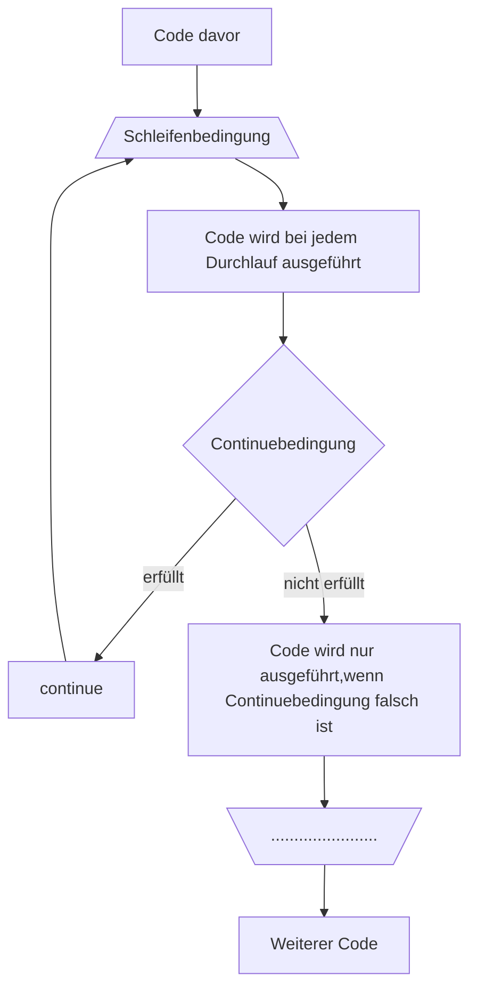

Es gibt nicht nur die Möglichkeit Schleifen mit `break` abzubrechen, sondern auch einzelne Schleifendurchläufe zu überspringen. Dazu dient das Keyword `continue`. Es heißt so viel, wie *"Continue with next loop"* (*"Fahre mit nächstem Durchlauf fort"*).

```c
while(/* Schleifenbedingung */) {

    // Code wird bei jedem Durchlauf ausgeführt

    if(/* Continuebedingung */)
        continue;

    // Code wird nur ausgeführt, wenn Continuebedingung falsch ist.
    
}
```

Wenn vom Programm auf das `continue` trifft, wird als erstes wieder die Schleifenbedingung geprüft und dann der Schleifenkörper ausgeführt. Daher ist das `continue` auch immer mit einer Verzweigung gepaart. Im Gegensatz zu `break` kann `continue` auch innerhalb von des `switch` statements verwendet werden. Es bezieht sich immer auf die Schleife.

